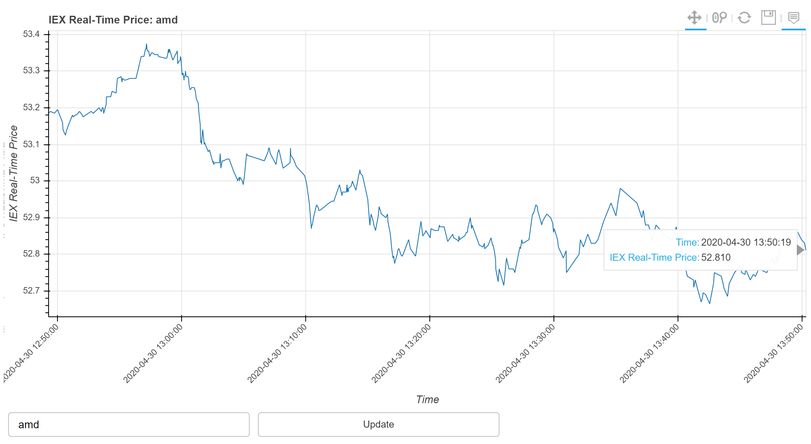

To run the code:  
python -m bokeh serve iex.py  
or  
bokeh serve iex.py  

### Demonstrate real time streaming data using bokeh server.

#### Background:  
I was trying to test various methods of acquiring real time streaming data with bokeh server and stock market quotes easily came to mind.  IEX is one of the market provider offering free quotes through its API.  In addition, from its [site](https://iextrading.com/developers/docs/#unofficial-libraries-and-integrations), it has a linked to some samples using [bokeh server](https://gist.github.com/zduey/66ed98cf3fc2b161df47c0c08954dc62).  

#### Method:
Data comes as a near real time last sale price and time (as well as size but not relevant for this exercise) from IEX Market data provider, more from the site, [TOPS](https://iextrading.com/trading/market-data/).  

The maximum number of points in the figure, 3600 data points, represents 1 hour of 1 second data, i.e. plot refresh every second in terms of milliseconds.

Time is eastern time zone, New York City, the source of the data.

There is no ability to verify the Ticker Symbol from IEX Market so it may not retrieve all symbols found in the stock market.

The datetime type is required for the ColumnDataSource so there were steps needed to convert pandas series to datetime.

During start up, the ColumnDataSource has no time values due to no data so a conditional check will default to current time and price of $0.00.

DatetimeTickFormatter is required to display the x-axis datetime in a meaningful format so several formats are provided in the code.

#### TODO:
Clean up the plot for better viewing experience.
Add more settings to suit user preferences.
Convert user entry to upper case for display.

